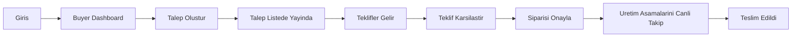
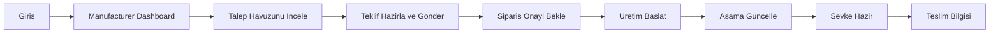
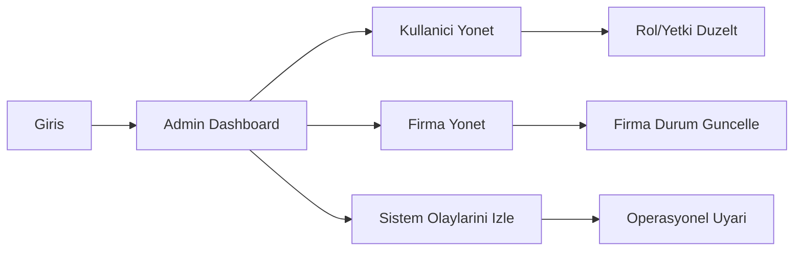
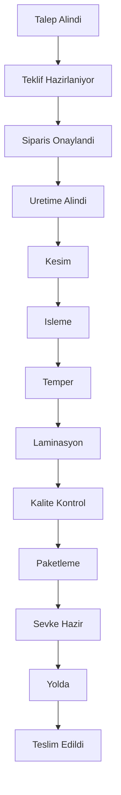

# Modul 01 - Kullanici Akislari

## 1. Alici Ana Akisi

```mermaid
flowchart LR
  A[Giris] --> B[Buyer Dashboard]
  B --> C[Talep Olustur]
  C --> D[Talep Listede Yayinda]
  D --> E[Teklifler Gelir]
  E --> F[Teklif Karsilastir]
  F --> G[Siparisi Onayla]
  G --> H[Uretim Asamalarini Canli Takip]
  H --> I[Teslim Edildi]
```

## 2. Uretici Ana Akisi

```mermaid
flowchart LR
  A[Giris] --> B[Manufacturer Dashboard]
  B --> C[Talep Havuzunu Incele]
  C --> D[Teklif Hazirla ve Gonder]
  D --> E[Siparis Onayi Bekle]
  E --> F[Uretim Baslat]
  F --> G[Asama Guncelle]
  G --> H[Sevke Hazir]
  H --> I[Teslim Bilgisi]
```

## 3. Yonetici Ana Akisi

```mermaid
flowchart LR
  A[Giris] --> B[Admin Dashboard]
  B --> C[Kullanici Yonet]
  B --> D[Firma Yonet]
  B --> E[Sistem Olaylarini Izle]
  C --> F[Rol/Yetki Duzelt]
  D --> G[Firma Durum Guncelle]
  E --> H[Operasyonel Uyari]
```

## 4. Siparis Asama Durum Akisi

```mermaid
flowchart TD
  A[Talep Alindi] --> B[Teklif Hazirlaniyor]
  B --> C[Siparis Onaylandi]
  C --> D[Uretime Alindi]
  D --> E[Kesim]
  E --> F[Isleme]
  F --> G[Temper]
  G --> H[Laminasyon]
  H --> I[Kalite Kontrol]
  I --> J[Paketleme]
  J --> K[Sevke Hazir]
  K --> L[Yolda]
  L --> M[Teslim Edildi]
```
